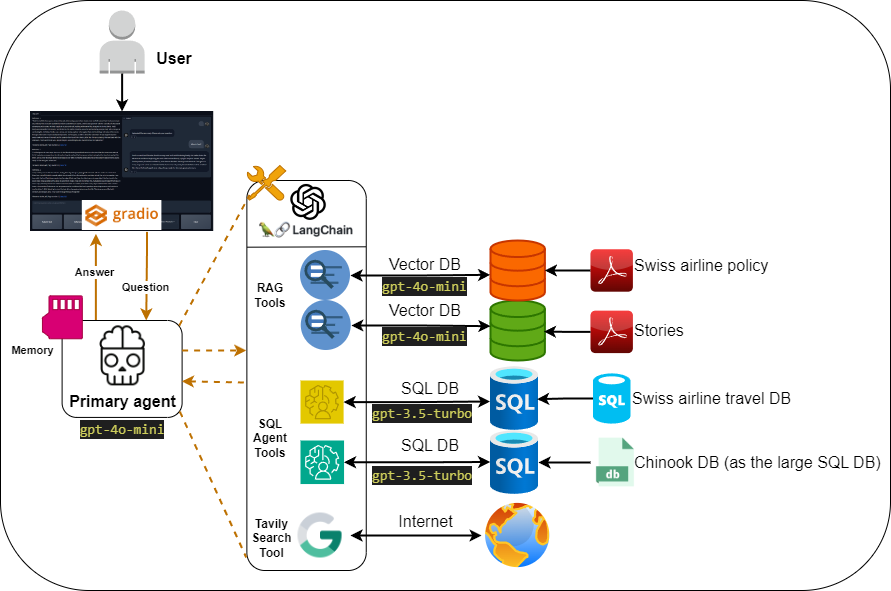
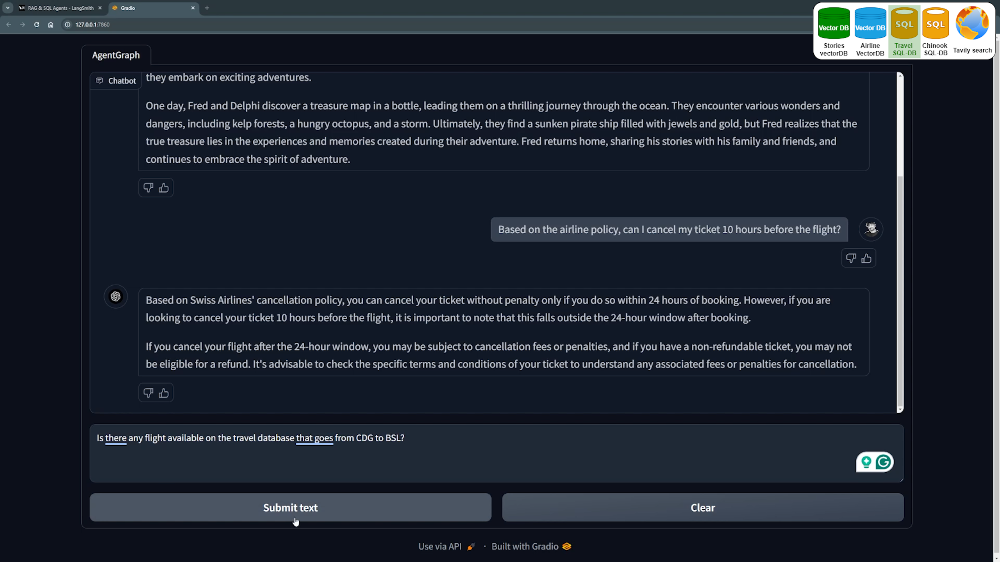

---

# AgentGraph: Sistema de perguntas e respostas de agentes SQL inteligentes e RAG para bate-papo com vários bancos de dados

Este projeto demonstra como construir um sistema de agente usando Large Language Models (LLMs) que pode interagir com vários bancos de dados e utilizar várias ferramentas. Ele destaca o uso de agentes SQL para consultar bancos de dados grandes de forma eficiente. As principais estruturas usadas neste projeto incluem OpenAI, LangChain, LangGraph, LangSmith e Gradio. O produto final é um chatbot de ponta a ponta, projetado para executar essas tarefas, com o LangSmith usado para monitorar o desempenho dos agentes.

---

## Explicação do vídeo:
Uma explicação detalhada do projeto está disponível no seguinte vídeo do YouTube:

Automatizando agentes LLM para conversar com vários/grandes bancos de dados (combinando agentes RAG e SQL): [Link](https://youtu.be/xsCedrNP9w8?si=v-3k-BoDky_1IRsg)

---

## Requisitos

- **Sistema operacional:** Linux ou Windows (testado no Windows 11 com Python 3.9.11)
- **Chave de API OpenAI:** necessária para a funcionalidade GPT.
- **Credenciais Tavily:** necessárias para ferramentas de pesquisa (grátis no seu perfil Tavily).
- **Credenciais LangChain:** necessárias para LangSmith (grátis no seu perfil LangChain).
- **Dependências:** as bibliotecas necessárias são fornecidas no arquivo `requirements.txt`.
---

## Instalação e execução

Para configurar o projeto, siga estas etapas:

1. Clone o repositório:
```bash
git clone https://github.com/thiagonishimura/DETER_IA_LLM_RAG.git
```
2. Instale o Python e crie um ambiente virtual:
```bash
python -m venv venv
```
3. Ative o ambiente virtual:
- No Windows:
```bash
venv\Scripts\activate
```
- No Linux/macOS:
```bash
source venv/bin/activate
```
4. Instale as dependências necessárias:
```bash
pip install -r requirements.txt
```
5. Baixe o banco de dados SQL do Travel neste link e cole-o na pasta `data`.

6. Baixe o banco de dados SQL do Chinook neste link e cole-o na pasta `data`.

7. Prepare o arquivo `.env` e adicione seu `OPEN_AI_API_KEY`, `TAVILY_API_KEY` e `LANGCHAIN_API_KEY`.

8. Execute o módulo `prepare_vector_db.py` uma vez para preparar ambos os bancos de dados de vetores.
```bash
python src\prepare_vector_db.py
```
9. Execute o aplicativo:
```bash
python src\app.py
```
Abra a URL do Gradio gerada no terminal e comece a conversar.

*Perguntas de exemplo estão disponíveis em `sample_questions.txt`.*

---

### Usando seu próprio banco de dados

Para usar seus próprios dados:
1. Coloque seus dados na pasta `data`.
2. Atualize as configurações em `tools_config.yml`.
3. Carregue as configurações em `src\agent_graph\load_tools_config.py`.

Para dados não estruturados usando Retrieval-Augmented Generation (RAG):
1. Execute o seguinte comando com a configuração do seu diretório de dados:
```bash
python src\prepare_vector_db.py
```

Todas as configurações são gerenciadas por meio de arquivos YAML na pasta `configs`, carregada por `src\chatbot\load_config.py` e `src\agent_graph\load_tools_config.py`. Esses módulos são usados ​​para uma distribuição limpa de configurações em todo o projeto.

Quando seus bancos de dados estiverem prontos, você pode conectar os agentes atuais aos bancos de dados ou criar novos agentes. Mais detalhes podem ser encontrados no vídeo do YouTube que acompanha.

---

## Esquemas de Projeto

### Visão geral de alto nível

<div align="center">

</div>

### Esquema Detalhado

<div align="center">

</div>

### Esquema de Gráfico

<div align="center">

</div>

### Agente SQL para estratégias de grandes bancos de dados

<div align="center">

</div>

---

## Interface de Usuário do Chatbot

<div align="center">

</div>

---

## Sistema de monitoramento LangSmith

<div align="center">

</div>

---

## Bancos de dados usados

- **Banco de dados SQL de viagens:** [Link do Kaggle](https://www.kaggle.com/code/mpwolke/airlines-sqlite)
- **Banco de dados SQL Chinook:** [Banco de dados de amostra](https://database.guide/2-sample-databases-sqlite/)
- **stories VectorDB**
- **Perguntas frequentes sobre política de companhias aéreas VectorDB**
---

## Principais estruturas e bibliotecas

- **LangChain:** [Introdução](https://python.langchain.com/docs/get_started/introduction)
- **LangGraph**
- **LangSmith**
- **Gradio:** [Documentação](https://www.gradio.app/docs/interface)
- **OpenAI:** [Início rápido do desenvolvedor](https://platform.openai.com/docs/quickstart?context=python)
- **Tavily Search**
---
